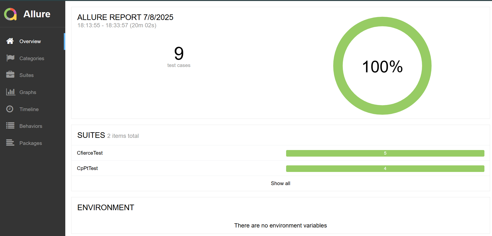

# Demonstration of Test Parameterization with JUnit 5

[](https://www.java.com)
[](https://gradle.org)
[](https://junit.org/junit5/)
[](https://selenide.org/)
[](https://qameta.io/allure-framework/)

This repository is a demonstration project showing various ways to parameterize autotests using the JUnit 5 framework. To demonstrate the versatility of the approach, the tests are written for two independent websites.

## 💡 Annotations for Parameterization

#### 1. `@ValueSource`

* **What it does:** Allows passing an array of simple values (strings, numbers) as arguments to a test.

#### 2. `@CsvSource`

* **What it does:** Allows passing multiple arguments to a test as CSV strings (`"value1, value2"`). Ideal for checking key-value pairs.

#### 3. `@EnumSource`

* **What it does:** Allows passing values from an `Enum` to a test. This provides type safety and cleaner code when working with a predefined set of constants.

#### 4. `@MethodSource`

* **What it does:** The most flexible way of parameterization. It allows using a static method that returns a `Stream` of complex arguments, such as lists or objects.

## 🛠️ Tech Stack

| Purpose | Tool / Library | 
| ----- | ----- | 
| **Language** | `Java 11` | 
| **Build Tool** | `Gradle` | 
| **Test Framework** | `JUnit 5.10.0` | 
| **UI Automation** | `Selenide 6.19.1` | 
| **Reporting** | `Allure Framework 2.19.0` | 

## ✅ Running Tests

### Run all tests

```bash
./gradlew test
```

*For Windows, use `gradlew.bat test`*

### Run tests by tag

You can run tests for a specific site or scenario using the tags specified in the code (`@Tag("ID 1")`, `@Tag("ID 3")`, etc.).

For example, to run all tests with the tag `ID 1`:

```bash
./gradlew test -D"junit.jupiter.tags.include=ID 1"
```

*For Windows, use `gradlew.bat test -D"junit.jupiter.tags.include=ID 1"`*

## 📊 Viewing the Allure Report

To generate and view the interactive test report, run the command:

```bash
./gradlew allureServe
```

*For Windows, use `gradlew.bat allureServe`*


